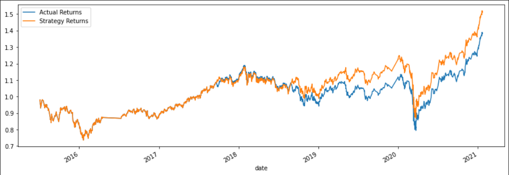
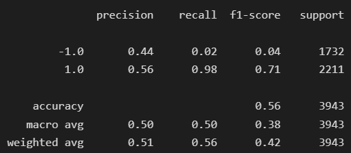
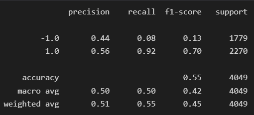
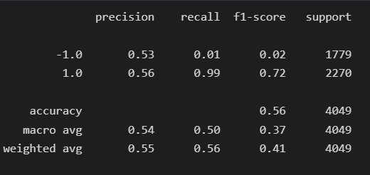
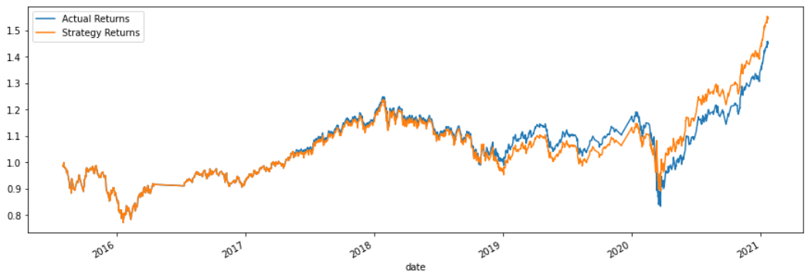

# ML Trading Bot | Evaluation Report

### Table of Contents:

1. [Original Baseline Algorithm](#originalprovided-baseline-algorithm)

2. [Tuned Baseline Algorithm:](#tuned-baseline-algorithm)

3. [Multi-layer Perceptron (MLP) Algorithm:](#multi-layer-perceptron-mlp-algorithm)

4. [Evaluation](#evaluation)

---
**Note:** The provided CSV file contains OHLCV data for an MSCI&ndash;based emerging markets ETF that [iShares](https://www.ishares.com/us/products/268704/ishares-currency-hedged-msci-emerging-markets) issued.
 

### Original/Provided Baseline Algorithm:

`The SVM model generated an accuracy score of 55% and a high recall score (96%) when buying but a low recall score (4%) when selling. This indicates the model performs extremely well when determining when to enter a position.`

  

  

`The model used actual returns from 2018 to 2021 and could be improved by increasing the timeframe.`

 

### Tuned Baseline Algorithm:

`Adjusted the Size of Training Data: Increasing the training window to 6 months did impact the results slightly.`

* The cumulative return plot shows a little less volatility in prices during the years 2019-2020, compared to the original model results.

* Accuracy score increased slightly

    (original model --> 55%, tuned size of training dataset model: 56%)

  

  

`Adjusted the SMA input features: Increasing the short SMA window to 8 and decreasing the long SMA window to 20 months impacted the results a little bit.`

* The strategy returns are a bit closer to the actual returns compared to the provided baseline model, indicating the model is learning and predicting quite accurately.

* Accuracy score remained the same as the original model, however the recall for selling (-1) increased indicating the tuned model will learn to predict when to sell a little better.

  

  

`The tuned model was able to use more actual returns from 2016 to 2021 indicating that the model is learning off of more data.`

 

### Multi-layer Perceptron (MLP) Algorithm:

`The MLP model performed slightly better than the original baseline model and the tuned model, when determining when to enter (buy) a postion (1).`

* The model generated an almost perfect recall score (99%) for the buying target (1) which is a good thing since we are ultimately trying to create a trading algorithm that determines the best entry positions.

* The tuned strategy was able to train over a longer time-period and generated a higher recall score for both buying and selling. However when creating a trading algo that should be able to determine the best entry positions, we should focus on generating a higher recall score for the buying target (1) because the model will able to make extremely less mistakes when identifying when to enter a position.

  

  

### Evaluation:
  
* The MLP algorithm with Stochastic Gradient Descent (SGD), which belongs in the class of feedforward artifical neural networks, was chosen due to its ability to minimize the cost function, which in this case would be -1 or "sell". If the model determines an exit point incorrectly it can cost the investor highly, which is why we want a model that can identify "buys" better than being able to identify when to "sell".

* Looking back at the models we can conclude that the Multilayer Perceptron (MLP) model performed the best because it generated an extremely high recall score (99%) for the buying target which indicates that the model will determine when to buy very well.
  
* Looking at the MLP cumulative return plot, we can see that the strategy returns are much closer to the actual returns compared to the other models. This could indicate that the model is "learning" from the data and predicted quite accurately.

---
